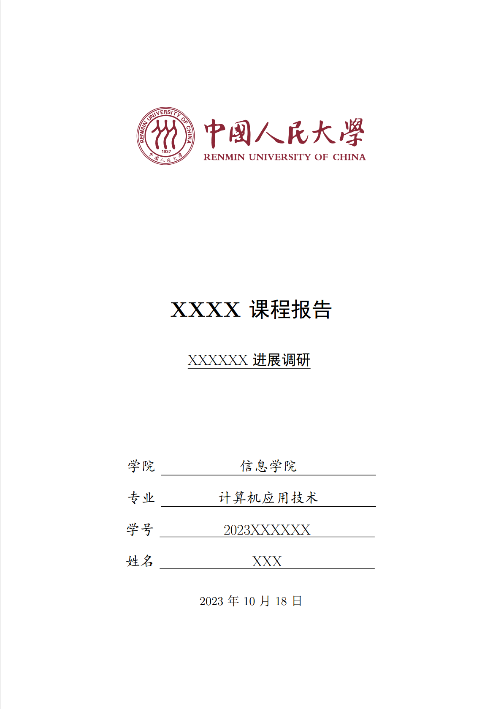
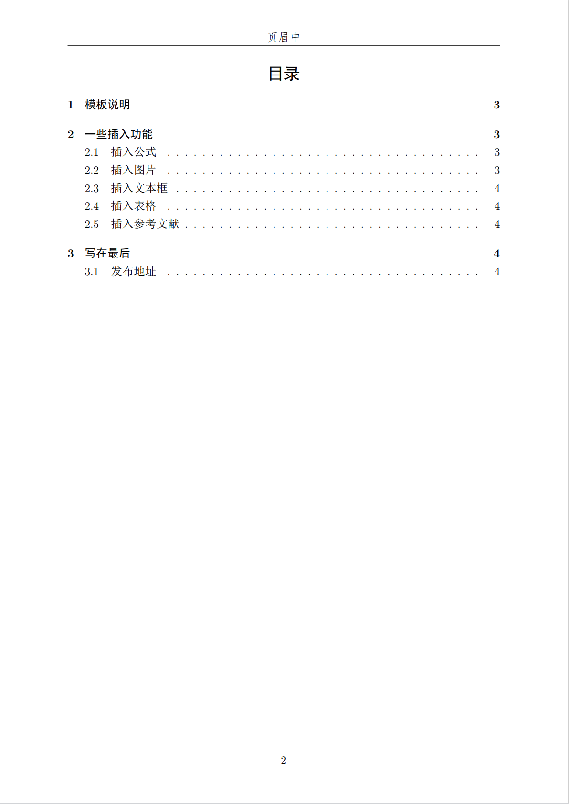

<h1 align="center">
  

   
  中国人民大学通用课程报告模板

</h1>

  Latex Template for RUC Report

## 介绍
- 用于中国人民大学(RUC)课程报告的通用简易Latex模板
- **fork from author xxmy7 (https://github.com/xxmy7)**

## 模板下载

* 页面右边点击：**Clone or download -> Download Zip**
* 已经上传至Overleaf模板，开箱即用 :point_right: [Overleaf](https://www.overleaf.com/latex/templates/ruc-report-latex-template/hhwhvvwczbnm)

## 使用方法

默认模板文件由以下四部分组成：

- `main.tex` 主文件,包含报告正文
- `reference.bib` 参考文献列表
- `RUCReport.sty` 文档格式控制，包括一些基础的设置，可以设置页眉、标题、姓名等
- `figures` 放置图片的文件夹,包含院校LOGO和效果预览图

使用时需前往`RUCReport.sty` 对标题、副标题、姓名、学号、学院、页眉等进行设置，然后编辑`main.tex`进行正文编写

|  [封面效果图](https://github.com/xxmy7/RUC_Report_Latex_Template/blob/master/figures/cover.png) |  [目录效果图](https://github.com/xxmy7/RUC_Report_Latex_Template/blob/master/figures/content.png)| 
|:---:|:---:|
|  | | 

## 参考
本项目大部分内容源自[中国科学院大学通用课程大作业模板](https://github.com/jweihe/UCAS_Latex_Template), 感谢各位作者！

[1] [中国科学院大学通用课程大作业模板](https://github.com/jweihe/UCAS_Latex_Template)

[2] [GBT7714-2015标准下的BibTex样式](https://github.com/zepinglee/gbt7714-bibtex-style)

[3] [国科大学位论文LaTeX模板](https://github.com/mohuangrui/ucasthesis)

[4] [北京大学课程论文模板](https://www.overleaf.com/latex/templates/bei-jing-da-xue-ke-cheng-lun-wen-mo-ban/yntmqcktrzfh)

[5] [中国人民大学beamer模板](https://github.com/GohUnTsuan/RUC-Beamer-Theme)
